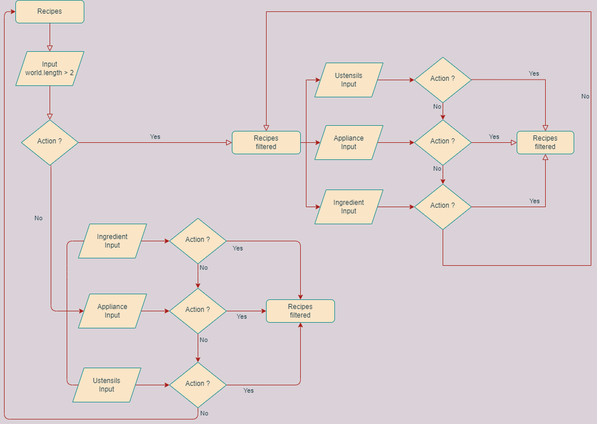
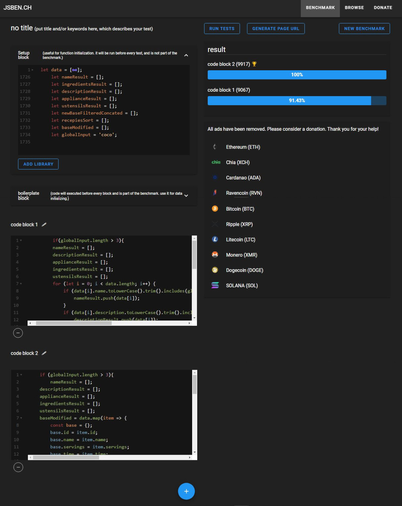

# Rakotonirina_JeanSebastien_7_18122021, Dev d'applications REACT/JS
# OpenClassRooms : P7 Développez un algorithme de recherche en javascript
- Analyser un problème informatique
- Développer un algorithme pour résoudre un problème

## Les petits plats
Les Petits Plats est un moteur de recherche qui permet de trouver rapidement des recettes correspondant à l’entrée utilisateur dans : le titre de
la recette, la liste des ingrédients de la recette, la description de la recette.

## 1. Cas d’utilisation

  
  
  
  

L'application consiste en une page simple, réalisée avec Javascript (sans Framework) utilisant des fonctions natives (foreach, map, filter,...) dans la branch Algo2 et des boucles (for), des conditions (if, else if) dans la branch Master, au niveau de l'input principal, comme demandé et vu avec mon Mentor. 

L'utilisateur pourra donc chercher une recette parmi 50, soit via les mots clés qui mactheront avec le nom, la liste des ingrédients ou la description, soit via un input placé dans 3 dropdowns (ingrédients, appareil, ustensils) ou en cliquant sur un lien correspondant à la création d"un tag qui apparaitra sous l'input principal portant le nom du lien de la liste d'une des 3 catégories. La base est dans le fichier ./js/recipes.js, les recettes sont stockées dans un tableau appelé data.  

./js/globalSearch.js renferme l'algorithme dans chacune des branch sous la class du même nom. L'utilisation des fonctions natives améliorent considérablement les performances, logique, sinon leurs existences seraient remises en question. Mais le moyen le plus efficace pour appuyer cette thèse est le test des 2 algos dans jsBench et le résultat est sans appel. 

Pour illustrer les deux algorithmes, j'ai utilisé Draw.io, comme conseillé dans la feuille de route.

for(let a=0; a < améliorations.length; a++){if(certaines améliorations étaient réalisées){j'aurais peut-être gagné du temps}else{Ou alors c'est un test de débrouillardise};}
- Plus de cours sur le développement d'un moteur de recherche en js ou autre.
- Meilleure base de données, celle-ci est corrompue par des doublons, des erreurs...
- Gestion des accents absente, si je saisis creme sans accent, cela ne foncttione pas.
- J'ai évité au maximum les répétitions dans le code, mais elles sont là.

Conclusion, j'ai toujours ce plaisir particulier, à découvrir chaque nouveau projet, fasciné par les différents fabuleux design, simples toujours dans le thème, motivant et repoussant ainsi mes limites pour aller vers le meilleur de moi-même. P7 montre l'importance des fonctions natives javascrit ou autre, pourtant mea culpa, j'ai tendance à faire l'inverse. La preuve étant, j'ai développé l'algo sans fonctions natives en premier d'où le nom de la branch, resté inchangé, Master.

## Fiche d'investigation
see documentation [here](https://github.com/jsr029/Rakotonirina_JeanSebastien_7_18122021/tree/Algo-1/Fiche.jpg)

## Algorigram
see documentation [here](https://github.com/jsr029/Rakotonirina_JeanSebastien_7_18122021/tree/Algo-2/P7algorigram.png)

## Site
see Demo [here](https://jsr029.github.io/Rakotonirina_JeanSebastien_7_18122021)

## Structure
see Structure [here](https://github.com/jsr029/Rakotonirina_JeanSebastien_7_18122021/tree/Algo-2/structure2.svg)

## jsBench
see Test [here](https://github.com/jsr029/Rakotonirina_JeanSebastien_7_18122021/tree/Algo-2/P7jsBecnhEntirePage.JPG)

## Légendes 
- Code Block1 : boucles for... et conditions if... else if...
- Code Block2 : fonctions natives foreach...map...filter...

## Axes d'amélioration :
- Utiliser des slides pour votre présentation
- Revenir à la liste des recettes precedentes lorsqu'on supprime un tag
- Pensez au responsive
- Revoir les algorigrammes
- Revoir l'utilisation de classe (Majuscule au debut du nom de la classe et du fichier)
